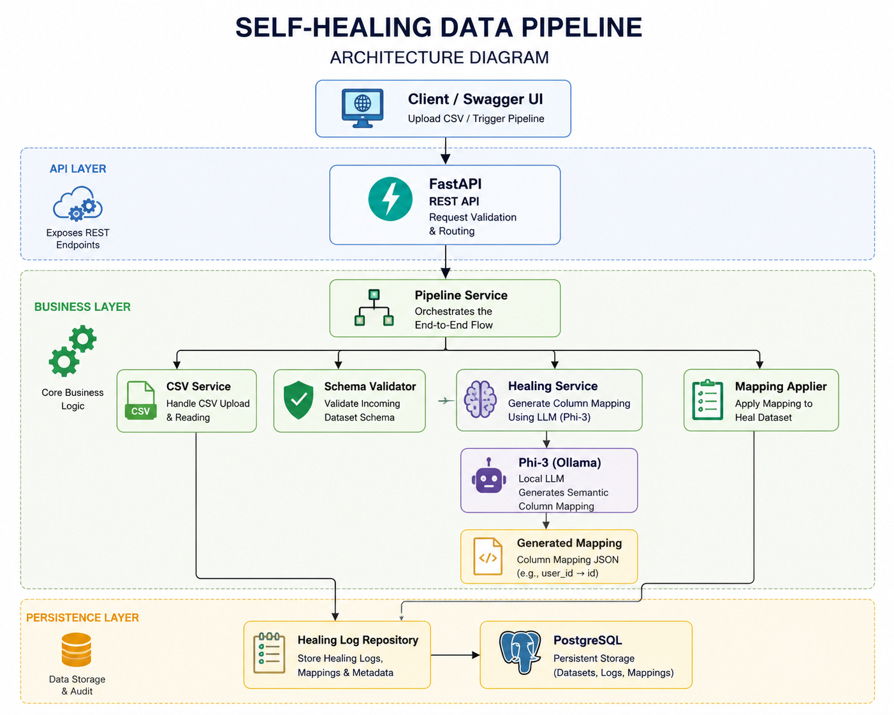

# Self-Healing Data Pipeline

## Architecture

## Overview

Self-Healing Data Pipeline is an AI-powered data ingestion system that automatically detects schema drift in incoming CSV datasets and repairs mismatched columns using a local Large Language Model (Phi-3 via Ollama).

The system validates incoming datasets against an expected schema, generates intelligent column mappings using an LLM, applies corrections automatically, and stores an audit trail of all healing operations.

---

## Problem Statement

Traditional ETL and data ingestion pipelines often fail when source systems rename columns or introduce schema changes.

Example:

Expected Schema:

* id
* price
* transaction_date

Incoming Dataset:

* user_id
* cost
* date_of_purchase

Without intervention, most pipelines fail validation and require manual fixes.

---

## Solution

The pipeline automatically:

1. Accepts CSV uploads
2. Detects schema drift
3. Uses Phi-3 to generate semantic column mappings
4. Applies healing transformations
5. Re-validates the dataset
6. Stores healing logs for auditing

---

## Features

* CSV Dataset Upload
* Schema Validation
* AI-Powered Column Mapping
* Automatic Schema Healing
* Healing Audit Logs
* Dataset Status Tracking
* PostgreSQL Persistence
* Alembic Database Migrations
* Docker Support

---

## Tech Stack

Backend:

* FastAPI
* Python
* SQLAlchemy
* PostgreSQL
* Alembic

AI:

* Ollama
* Phi-3

Data Processing:

* Pandas

Infrastructure:

* Docker
* Docker Compose

---

## Workflow

1. Upload CSV Dataset
2. Validate Columns
3. Detect Missing Columns
4. Generate AI Mapping
5. Apply Mapping
6. Revalidate Dataset
7. Store Healing Log
8. Mark Dataset as Completed

---

## Example

Input:

user_id,cost,date_of_purchase

Expected:

id,price,transaction_date

Generated Mapping:

{
"user_id": "id",
"cost": "price",
"date_of_purchase": "transaction_date"
}

Result:

Dataset healed successfully.

---

## Future Enhancements

* Confidence Scoring
* Mapping Explanations
* RAG-Based Historical Mapping Retrieval
* Support for Excel and Parquet Files
* Workflow Dashboard
* Multi-Schema Support

---

## Author

Dhruv Kaura
